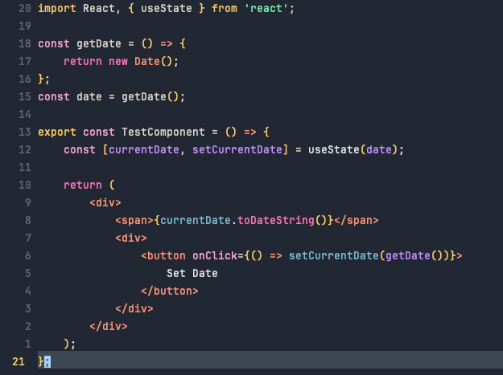

# Search Lights for Neovim

A dark Neovim colorscheme ported from the VS Code theme by radiolevity.

## Screenshots



## Features

- Two theme variants: **Search Lights** (vibrant) and **Desert Lights** (muted)
- True color (24-bit) support
- Treesitter highlighting support
- LSP semantic token support
- Extensive plugin support out of the box
- Configurable italic comments
- Optional transparent background

## Requirements

- Neovim >= 0.8.0
- `termguicolors` enabled (the theme will enable this automatically)
- A terminal with true color support (iTerm2, Kitty, Alacritty, WezTerm, etc.)

## Installation

### lazy.nvim (recommended)

```lua
{
  "bittersweetryan/search-lights-nvim",
  lazy = false,
  priority = 1000, -- Load before other plugins
  config = function()
    require("search-lights").setup({
      variant = "search_lights", -- or "desert_lights"
      italic_comments = true,
      transparent = false,
    })
    vim.cmd.colorscheme("search-lights")
  end,
}
```

### packer.nvim

```lua
use {
  "bittersweetryan/search-lights-nvim",
  config = function()
    require("search-lights").setup({})
    vim.cmd.colorscheme("search-lights")
  end
}
```

### vim-plug

```vim
Plug 'bittersweetryan/search-lights-nvim'
```

Then in your `init.vim` (after `plug#end()`):

```vim
set termguicolors
colorscheme search-lights
" or for the muted variant:
" colorscheme desert-lights
```

### Manual Installation

Clone the repository to your Neovim packages directory:

```bash
# For Neovim (Linux/macOS)
git clone https://github.com/bittersweetryan/search-lights-nvim.git \
  ~/.local/share/nvim/site/pack/themes/start/search-lights

# For Neovim (Windows)
git clone https://github.com/bittersweetryan/search-lights-nvim.git \
  ~/AppData/Local/nvim-data/site/pack/themes/start/search-lights
```

Then add to your `init.lua`:

```lua
vim.cmd.colorscheme("search-lights")
```

## Theme Variants

### Search Lights (default)

The main theme with vibrant colors and yellow accents. Best for those who prefer high contrast and colorful syntax highlighting.

```lua
vim.cmd.colorscheme("search-lights")
```

### Desert Lights

A more muted variant with darker, grayer backgrounds and blue accents instead of yellow. Better for low-light environments or those who prefer subtler colors.

```lua
vim.cmd.colorscheme("desert-lights")
```

## Configuration

Call `setup()` before loading the colorscheme to customize options:

```lua
require("search-lights").setup({
  -- Theme variant: "search_lights" or "desert_lights"
  variant = "search_lights",

  -- Enable italic style for comments
  italic_comments = true,

  -- Make background transparent (useful for terminal transparency)
  transparent = false,
})

-- Load the colorscheme
vim.cmd.colorscheme("search-lights")
```

### Configuration Options

| Option | Type | Default | Description |
|--------|------|---------|-------------|
| `variant` | string | `"search_lights"` | Theme variant (`"search_lights"` or `"desert_lights"`) |
| `italic_comments` | boolean | `true` | Use italic style for comments |
| `transparent` | boolean | `false` | Disable background colors for transparency |

## Plugin Support

The theme includes built-in support for many popular plugins. Most plugins will work automatically once the colorscheme is loaded.

### Supported Plugins

| Category | Plugins |
|----------|---------|
| File Explorers | nvim-tree, neo-tree, coc-explorer |
| Status Lines | lualine, vim-airline |
| Buffers/Tabs | bufferline, barbar |
| Fuzzy Finder | telescope |
| Completion | nvim-cmp, coc.nvim |
| LSP | Built-in LSP, coc.nvim |
| Git | gitsigns, coc-git |
| Syntax | Treesitter, rainbow-delimiters |
| UI | which-key, lazy.nvim, mason, nvim-notify, indent-blankline, noice, flash, mini |

### Lualine Setup

The theme provides a dedicated lualine theme:

```lua
require("lualine").setup({
  options = {
    theme = require("search-lights").lualine(),
    -- or for desert lights:
    -- theme = require("search-lights").lualine("desert_lights"),
  },
})
```

**Full lualine example:**

```lua
require("lualine").setup({
  options = {
    theme = require("search-lights").lualine(),
    component_separators = { left = "", right = "" },
    section_separators = { left = "", right = "" },
  },
  sections = {
    lualine_a = { "mode" },
    lualine_b = { "branch", "diff", "diagnostics" },
    lualine_c = { "filename" },
    lualine_x = { "encoding", "fileformat", "filetype" },
    lualine_y = { "progress" },
    lualine_z = { "location" },
  },
})
```

### vim-airline Setup

Set the airline theme in your config:

**Lua (init.lua):**

```lua
vim.g.airline_theme = "search_lights"
-- or for desert lights:
-- vim.g.airline_theme = "desert_lights"
```

**VimScript (init.vim):**

```vim
let g:airline_theme = 'search_lights'
" or for desert lights:
" let g:airline_theme = 'desert_lights'

" Optional: enable tabline
let g:airline#extensions#tabline#enabled = 1
```

### Bufferline Setup

The theme provides custom highlights for bufferline:

```lua
require("bufferline").setup({
  highlights = require("search-lights").bufferline(),
  -- or for desert lights:
  -- highlights = require("search-lights").bufferline("desert_lights"),
  options = {
    -- your bufferline options
  },
})
```

**Full bufferline example:**

```lua
require("bufferline").setup({
  highlights = require("search-lights").bufferline(),
  options = {
    mode = "buffers",
    diagnostics = "nvim_lsp",
    show_buffer_close_icons = true,
    show_close_icon = false,
    separator_style = "thin",
    offsets = {
      {
        filetype = "NvimTree",
        text = "File Explorer",
        highlight = "Directory",
        separator = true,
      },
    },
  },
})
```

### nvim-tree Setup

nvim-tree highlights are applied automatically. No additional configuration needed.

```lua
require("nvim-tree").setup({
  -- your nvim-tree options
})
```

### neo-tree Setup

neo-tree highlights are applied automatically. No additional configuration needed.

```lua
require("neo-tree").setup({
  -- your neo-tree options
})
```

### coc.nvim Setup

All coc.nvim and coc-explorer highlights are applied automatically when the colorscheme loads.

For coc-explorer, just use it as normal:

```vim
:CocCommand explorer
```

### Telescope Setup

Telescope highlights are applied automatically. No additional configuration needed.

```lua
require("telescope").setup({
  -- your telescope options
})
```

### barbar Setup

barbar highlights are applied automatically. No additional configuration needed.

```lua
require("barbar").setup({
  -- your barbar options
})
```

## API

The theme exposes several functions for advanced usage:

### Get the color palette

Access the raw color values for custom highlight groups:

```lua
local palette = require("search-lights").palette()

-- Use colors in your own highlights
vim.api.nvim_set_hl(0, "MyCustomGroup", {
  fg = palette.yellow,
  bg = palette.bg2,
  bold = true,
})
```

### Get lualine theme

```lua
local lualine_theme = require("search-lights").lualine()
-- or
local lualine_theme = require("search-lights").lualine("desert_lights")
```

### Get bufferline highlights

```lua
local bufferline_hl = require("search-lights").bufferline()
-- or
local bufferline_hl = require("search-lights").bufferline("desert_lights")
```

## Color Palette

### Search Lights

| Color | Hex | Usage |
|-------|-----|-------|
| Yellow | `#FFCC66` | Cursor, highlights, active elements, HTML tags |
| Orange | `#FF9473` | Types, constants, storage, decorators |
| Red | `#F56174` | Errors, classes, constructors, deleted |
| Magenta | `#FF75BC` | Keywords, statements, control flow |
| Magenta Light | `#FFA7D3` | Built-in variables, object constants |
| Purple | `#C38EFD` | Preprocessor, includes, macros |
| Purple Soft | `#CFAFFA` | JSON properties |
| Blue | `#8ca6bd` | Info, git changes |
| Blue Light | `#7DBBD1` | Functions, methods, regex |
| Cyan | `#7FCDFF` | Bracket highlights |
| Green | `#7ef2ae` | Strings, git additions, inserted |
| Green Soft | `#93FEC0` | Bracket highlights |
| Background | `#212733` | Editor background |
| Background Dark | `#1A1F28` | Sidebar, terminal background |
| Foreground | `#DDD7CA` | Default text |
| Foreground Dim | `#738699` | Inactive text |
| Comment | `#5C6773` | Comments |

### Desert Lights

Same accent colors as Search Lights, with different backgrounds:

| Element | Hex |
|---------|-----|
| Background | `#1C1C1C` |
| Background Alt | `#202020` |
| Foreground Dim | `#717171` |
| Active Accent | `#8CA6BD` (blue instead of yellow) |

## Troubleshooting

### Colors don't look right

Make sure `termguicolors` is enabled:

```lua
vim.opt.termguicolors = true
```

Also ensure your terminal supports true colors. Test with:

```bash
curl -s https://raw.githubusercontent.com/JohnMorales/dotfiles/master/colors/24-bit-color.sh | bash
```

### Transparent background not working

1. Make sure your terminal supports transparency
2. Enable the transparent option:

```lua
require("search-lights").setup({
  transparent = true,
})
```

### Plugin colors not applying

Make sure to load the colorscheme after setting up the theme:

```lua
-- Correct order
require("search-lights").setup({ ... })
vim.cmd.colorscheme("search-lights")

-- Then setup plugins
require("lualine").setup({ ... })
```

### Italic comments not showing

Your terminal and font must support italics. Test with:

```bash
echo -e "\e[3mThis should be italic\e[0m"
```

If it's not italic, check your terminal settings or try a different font (e.g., JetBrains Mono, Fira Code).

## Contributing

Contributions are welcome! Please feel free to submit issues or pull requests.

## Credits

- Original VS Code theme by [radiolevity](https://github.com/radiolevity)
- Neovim port maintained by the community

## License

MIT
